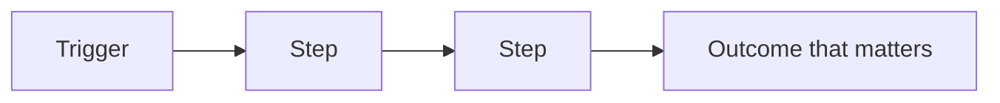
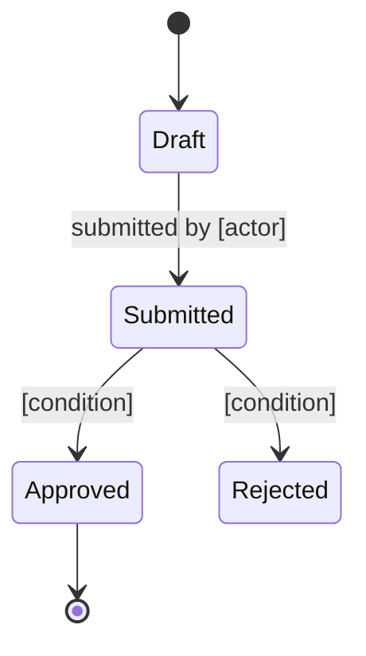

# [Product name] — What this system does

> Reconstructed from the codebase at [commit / date]. Written for readers who do not work in the code.
> Statements marked *(assumed)* were inferred from the implementation and have not been confirmed by anyone on the business side.

## In one paragraph

[What the product does, for whom, and the problem it removes. Plain language, no technical terms. If someone reads only this paragraph, they should be able to describe the product in a meeting.]

## Who uses it

| Actor | What they do here | What they cannot do |
|---|---|---|
| [Role] | [Their main actions] | [Meaningful restrictions] |

## The main concepts

Explain the four to eight ideas the business is built on. One short paragraph each — what it is, why it exists, what it connects to. Avoid the code's naming when the business uses a different word; use the business word and note the alias.

### [Concept]

[Definition in business terms. What it means for the product when one of these exists, changes, or disappears.]

## How the value flows

[Narrate the same flow in two or three sentences: what starts it, what has to be true along the way, what the business gets at the end.]

## Life of a [main entity]

[What each state means for the business, who moves it forward, and which moves are deliberately impossible.]

## The rules of the game

The conditions the system enforces, in business language. Each states what is required and what happens when it is not met.

| Rule | Why it matters | What happens if broken |
|---|---|---|
| [A claim cannot be paid before it is reviewed] | [Prevents paying invalid claims] | [The payment is refused and the claim returns to review] |

## Where the value lives

[The one or two things this system does that are genuinely hard to replace: a calculation, an integration, accumulated data, a manual process it eliminates. Everything else in the product exists to support this.]

## Vocabulary

| Term | Means | Also called |
|---|---|---|
| [Term] | [One-line definition] | [Alias in the interface or in the code] |

> Watch out for: [terms that mean different things to different teams, or the same thing under two names].

## What we still need to ask

Questions the code cannot answer. Each one is addressed to whoever would know.

1. **[Question]** — [Why it matters and what depends on the answer.] *(ask: [role])*
