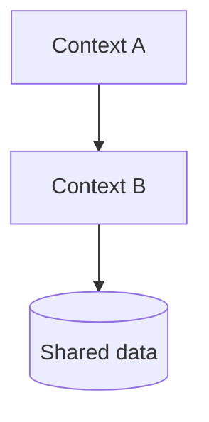
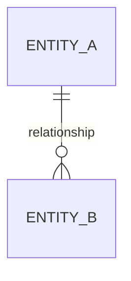
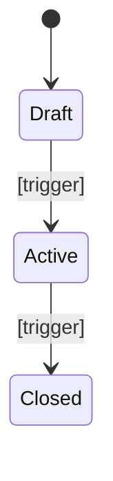

# [Product name] — Technical domain guide

> Reconstructed from the codebase at [commit / date]. For consultants and developers about to change this system.
> References point to `path/to/file.ext:line` as of that revision. Claims without a reference are inferences and are marked *(inferred)*.

## Orientation

[Two or three sentences: what the system does, what shape it is (single service, monorepo, modular monolith), and where the business logic actually lives versus where it merely passes through.]

**Discovery boundary:** [Contexts and deployables analyzed.] **Sampled or excluded:** [Areas intentionally not read and why.] **Confidence limits:** [Missing tools, unavailable contracts, conflicting evidence, or recommended next context.]

**Read these first:** `path/a.ext`, `path/b.ext`, `path/c.ext` — the three files that explain the most about the domain.

## Domain map

| Bounded context / module | Path | Owns | Depends on |
|---|---|---|---|
| [Name] | `src/...` | [Concepts it is authoritative for] | [Other contexts] |

[Where the boundaries are clean and where they leak. Leaks are where bugs and merge conflicts come from.]

## Model

| Entity | Defined at | Identity | Notes |
|---|---|---|---|
| [Name] | `path:line` | [Natural or surrogate key] | [Aggregate root, value object, lifecycle owner] |

## Lifecycles

| Transition | Enforced at | Guard | On violation |
|---|---|---|---|
| Draft → Active | `path:line` | [Condition] | [Error raised / behaviour] |

Transitions that are deliberately absent: [list them — knowing what is impossible is as useful as knowing what is possible].

## Invariants and business rules

Grouped by concept. Each rule states what it enforces, where it is enforced, and what happens when it is violated. Note where the same rule is enforced in more than one layer, and where it is enforced in none.

### [Concept]

| Rule | Evidence | Failure mode | Rationale |
|---|---|---|---|
| [What must hold] | `path:line` | [Exception, HTTP status, silent fallback] | [Documented / *unknown*] |

## Policies, constants and calculations

| What | Value | Location | Configurable |
|---|---|---|---|
| [Threshold, rate, window] | [Value] | `path:line` | [Yes / hardcoded] |

[Calculation logic worth understanding before touching it: rounding, precision, ordering of operations, currency handling.]

## Permissions and visibility

| Actor | Can | Enforced at |
|---|---|---|
| [Role] | [Operations] | `path:line` |

[Tenant or organization scoping: how it is applied, and where it could be forgotten.]

## Time-driven behaviour

| Job / trigger | Schedule | Business effect | Location |
|---|---|---|---|
| [Name] | [Cron or event] | [What changes in the business] | `path:line` |

## External contracts

| System | Direction | Purpose | Adapter |
|---|---|---|---|
| [Name] | inbound / outbound | [Business role] | `path:line` |

[What breaks in business terms when each one is unavailable.]

## Where the value lives, technically

[The modules that carry the differentiating logic, and why. This is where reviews should be strictest and test coverage highest.]

## Risks and observations

Things a newcomer should know before their first change. Facts and their consequences, not opinions about style.

- **[Observation]** — `path:line`. [Why it is a risk: duplicated rule, rule enforced only in the interface, unbounded query, business logic in a migration, dead branch, etc.]

## Glossary (code ↔ business)

| Code term | Business term | Defined at | Note |
|---|---|---|---|
| `[Identifier]` | [Business word] | `path:line` | [Synonym, homonym, or legacy naming] |

## Open questions

Answerable only by a person. Each includes what depends on the answer.

1. **[Question]** — [Context and evidence that raised it: `path:line`.] *(ask: [role])*
