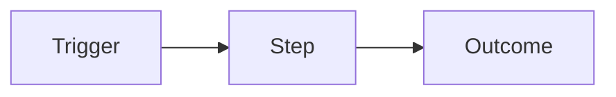
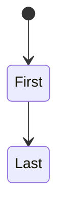

# [Context name] — Bounded context

> Reconstructed from the codebase at [commit / date]. Scope: the **[context]** bounded context within the wider product. Complements `../BUSINESS_OVERVIEW.md` and `../TECHNICAL_DOMAIN_GUIDE.md` — does not replace them. This document describes only behavior observed in the repository. Inconsistencies are recorded as observations, not questions for the reader.
> **Discovery boundary:** [Modules and deployables owned by this context.] **Sampled or excluded:** [Areas of this context intentionally not read and why.] **Confidence limits:** [Missing tools, unavailable contracts, or facts that could not be established from this context.]

## Why this context exists

[The business problem this bounded context solves, in business language. State what the wider product would lose if this context disappeared.]

## The main concepts

For each concept, the same five-question test as `../BUSINESS_OVERVIEW.md` § The main concepts applies — definition grounded in observed behavior, attributes and shape in the code's words, relationships with other concepts (in this context and across boundaries), processes it participates in, and why a newcomer must understand it.

A glossary of one-liners belongs at the end of the document; this section is where the model gets built. The breadth here is what the context owns — not a slice of the wider product.

### [Concept]

**What it is.** [...]

**Attributes and shape.** [...]

**Relationships with other concepts.** [For each relationship, name it specifically: in-context, or cross-context. Cross-context edges name the destination context explicitly.]

**Processes it participates in.** [...]

**Why a newcomer must understand it.** [...]

## How the value flows in this context

[Narrate in business terms: who triggers the flow, what has to be true along the way, what the business gets.]

## Life of a [main entity in this context]

[States, transitions, who moves them, which moves are deliberately impossible.]

## Invariants specific to this context

| Rule | Evidence | Confidence | Failure mode |
|---|---|---|---|

[State only rules that are specific to this context. Rules shared across contexts belong in `../BUSINESS_OVERVIEW.md` § The rules of the game and `../TECHNICAL_DOMAIN_GUIDE.md` § Invariants and business rules; reference them from here rather than duplicate.]

## Vocabulary (this context)

| Term | Means | Also called |
|---|---|---|

[Context-scoped terms only. The product-wide glossary is in `../BUSINESS_OVERVIEW.md` § Vocabulary.]

## Code ↔ business glossary (this context)

| Code term | Business term | Defined at | Note |
|---|---|---|---|
| `[Identifier]` | [Business word] | `path:line` | [Synonym, homonym, or legacy naming specific to this context] |

[Context-scoped code identifiers only. The product-wide glossary is in `../TECHNICAL_DOMAIN_GUIDE.md` § Glossary (code ↔ business).]

## Risks specific to this context

A new joiner working in this context should know before their first change. Each row states what could go wrong, why, and the closest context-level evidence.

- **BLOCKER — [Observation]** — `path:line`. [Why it is a blocker: rule enforced in two layers that can diverge, etc.]
- **RISK — [Observation]** — `path:line`. [Why it is a risk: hardcoded threshold, magic number, business logic in a migration, etc.]
- **SMELL — [Observation]** — `path:line`. [Why it is a smell: dead branch, naming confusion, etc.]

[Context-scoped risks only. Product-wide risks live in `../TECHNICAL_DOMAIN_GUIDE.md` § Risks and observations.]

## Related contexts

| Context | File | Relationship |
|---|---|---|
| [Name] | [`<other>.md`](<other>.md) | [Reads from / writes to / triggered by / …] |
| Product overview | [`../BUSINESS_OVERVIEW.md`](../BUSINESS_OVERVIEW.md) | This context is one part of what the business overview describes. Cross-reference it for any rule or concept that crosses boundaries, and for the "Three things that would surprise a newcomer". |
| Code map | [`../TECHNICAL_DOMAIN_GUIDE.md`](../TECHNICAL_DOMAIN_GUIDE.md) | The `path:line` evidence for every claim about code in this document lives there. |

If the product has only one context, replace this section with: *"This product is a single bounded context; no per-context files are produced."* When per-context files exist, every entry above links back to this section from its own "Related contexts", so navigation works in both directions.

## What this context does not establish

[Information absent from the repository, specific to this context. Same discipline as the overview document: describe the absent fact and where the absence was observed; do not ask the reader to resolve code inconsistencies.]
