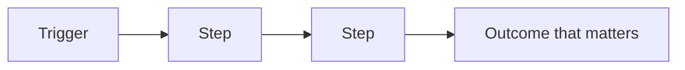
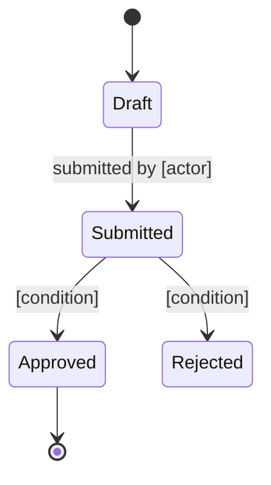

# [Product name] — What this system does

> Reconstructed from the codebase at [commit / date]. This document describes observed behavior only. It does not infer intent or propose corrections.
> Inconsistencies and ambiguities found in the code are recorded as observations with their evidence, not as questions for the reader to resolve.
> **Scope note:** [What was analyzed, what was sampled or excluded, and which facts could not be established from the repository.]

## In one paragraph

[What the product does, for whom, and the problem it removes. Plain language, no technical terms. If someone reads only this paragraph, they should be able to describe the product in a meeting.]

*Example —* *Acme Claims is a web platform that lets hospital billing teams submit, track, and contest insurance claims. It replaces a weekly manual reconciliation done by two analysts per hospital by centralizing insurer responses and surfacing the ones that need a human reply. Sold per claim processed; used by ~120 hospitals in the US.*

## Who uses it

| Actor | What they do here | What they cannot do |
|---|---|---|
| [Role] | [Their main actions] | [Meaningful restrictions] |

*Example —*
| *Hospital biller* | *Files claims, replies to insurer objections, exports monthly reports.* | *Cannot approve payouts or change fee schedules.* |
| *Acme reviewer* | *Approves contested claims, sets review priorities, escalates SLA breaches.* | *Cannot impersonate a biller in the portal.* |

## The main concepts

Explain the four to eight ideas represented in the code. Use the code's observed terminology; if the interface and implementation use different names, record both without deciding which is correct.

### [Concept]

[Definition based on observed behavior. State what happens when one exists, changes, or disappears. Do not state why it exists unless the repository explicitly documents that reason.]

*Example — Claim.* *A request for reimbursement sent by a hospital to an insurer. It has a status (Draft, Submitted, In Review, Paid, Rejected), a 48h review deadline, and a single reviewer assigned. If rejected, it returns to Draft; if paid, it is archived and surfaces in the hospital's monthly invoice.*

## How the value flows

[Narrate the same flow in two or three sentences: what starts it, what has to be true along the way, what the business gets at the end.]

*Example:* *A biller submits a claim from the portal; the system assigns a reviewer and starts a 48h clock. If the reviewer approves within the window, the claim is paid and the hospital is invoiced per claim; if they reject, it returns to the biller with the reason attached so the next submission can address it.*

## Life of a [main entity]

[What each state means for the business, who moves it forward, and which moves are deliberately impossible.]

*Example:* *A Claim starts when a biller submits it from the portal and ends when the insurer pays or rejects it. Reviewers move it from Submitted to In Review to Paid or Rejected; bypassing review is impossible because the Paid transition checks for a non-empty reviewer_id at the database level (see migrations/0042.sql:18).*

## The rules of the game

The conditions the system enforces, in business language. Each states what is required and what happens when it is not met.

| Rule | Why it matters | What happens if broken |
|---|---|---|
| [A claim cannot be paid before it is reviewed] | [Prevents paying invalid claims] | [The payment is refused and the claim returns to review] |

*Example:*
| *A claim cannot be paid before it is reviewed* | *Prevents paying invalid or fraudulent claims* | *The payment is refused and the claim returns to review with an error logged for the reviewer.* |
| *A reviewer cannot approve their own hospital's claims* | *Conflict-of-interest policy required by the insurer contracts* | *The approval endpoint returns 403; the action is recorded in the audit log.* |

## Where the value lives

[The one or two things this system does that are genuinely hard to replace: a calculation, an integration, accumulated data, a manual process it eliminates. Everything else in the product exists to support this.]

*Example:* *The pricing engine that converts insurer fee schedules into per-claim amounts. It handles ~40 insurer-specific rounding rules and is the only place in the product with more than 100 lines of pure decision logic. Everything else (portal, queueing, exports) exists to feed it input and surface its output.*

## Vocabulary

| Term | Means | Also called |
|---|---|---|
| [Term] | [One-line definition] | [Alias in the interface or in the code] |

*Example:*
| *Claim* | *A request for reimbursement sent by a hospital to an insurer.* | *`Claim`, `claim_request`, "case" in older UI strings.* |
| *Reviewer* | *An Acme employee authorized to approve or reject claims.* | *`claims_reviewer`, "approver" in legacy reports.* |

## Terminology traps

Cross-team vocabulary mismatches observed in the code. Each row names the trap, the two meanings, and where it shows up. List only traps that have caused or could cause a wrong business decision — not minor synonyms.

| Code / UI term | Business meaning | Why it confuses | Defined at |
|---|---|---|---|
| [Term as it appears in code or UI] | [What the business actually means] | [The wrong assumption a newcomer would make] | `path:line` |

*Example:*
| *"Submit" (button label)* | *"Send to internal review"* | *The UI says "Submit" but `submit_claim()` only moves the claim into Acme's review queue — it does not send anything to the insurer. Billers regularly believe they have filed with the insurer when they have not.* | `src/claims/actions.py:88` |
| *"Reject" (in code)* | *"Return to biller with reason"* | *The code raises `ClaimRejected` for both internal-review rejections and insurer rejections. The downstream email template treats them identically, which is wrong in the second case.* | `src/claims/exceptions.py:14`, `templates/rejection_email.*:7` |

## What the code does not establish

Record only missing evidence, such as an external contract, an undocumented rationale, or an actor not represented in the repository. Do not ask the reader to reconcile inconsistencies found in the code; describe those inconsistencies in the relevant section above with their evidence.

*Example:*
1. *Who owns the per-insurer fee schedule negotiation — product or finance? The code reads the schedules from `config/fees/` but nothing in the repository identifies the owner or the update cadence.*
2. *What is the contractual SLA with the insurer after the 48h internal review window expires? The code escalates to a human but does not record what the insurer is obligated to do next.*
