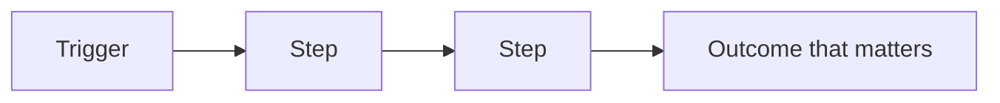
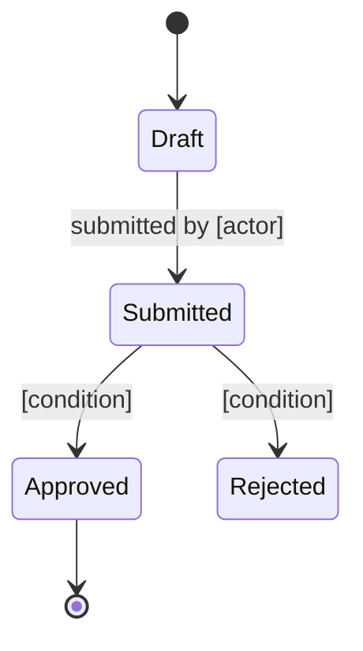

# [Product name] — What this system does

> Reconstructed from the codebase at [commit / date]. This document describes observed behavior only. It does not infer intent or propose corrections.
> Inconsistencies and ambiguities found in the code are recorded as observations with their evidence, not as questions for the reader to resolve.
> **Scope note:** [What was analyzed, what was sampled or excluded, and which facts could not be established from the repository.]

## Three things that would surprise a newcomer

[Three observed findings — drawn from the code, not inferred — that contradict what a reasonable reader would assume before opening the code. Each states what is surprising, why it is surprising, and the evidence. Hard cap at three; longer lists become decoration.]

*Example:*
1. *The "Submit" button does not send the claim to the insurer.* *It only enqueues the claim for Acme's internal review. Billers regularly leave the platform believing they have filed with the insurer when they have not.* — `src/claims/actions.py:88`
2. *"Reject" means two different things in the same flow.* *Internal-review rejections and insurer rejections share the `ClaimRejected` exception but require different downstream handling; the email template currently treats them identically.* — `src/claims/exceptions.py:14`, `templates/rejection_email.*:7`
3. *A claim can be marked Paid in the database even if the service-layer guard is bypassed.* *The Python guard and the DB CHECK are supposed to enforce the same rule, but they reject different transitions — either side can be patched without the other noticing.* — `src/claims/service.py:142`, `migrations/0042.sql:18`

## In one paragraph

[What the product does, for whom, and the problem it removes. Plain language, no technical terms. If someone reads only this paragraph, they should be able to describe the product in a meeting.]

*Example —* *Acme Claims is a web platform that lets hospital billing teams submit, track, and contest insurance claims. It replaces a weekly manual reconciliation done by two analysts per hospital by centralizing insurer responses and surfacing the ones that need a human reply. Sold per claim processed; used by ~120 hospitals in the US.*

## Who uses it

| Actor | What they do here | What they cannot do |
|---|---|---|
| [Role] | [Their main actions] | [Meaningful restrictions] |

*Example —*
| *Hospital biller* | *Files claims, replies to insurer objections, exports monthly reports.* | *Cannot approve payouts or change fee schedules.* |
| *Acme reviewer* | *Approves contested claims, sets review priorities, escalates SLA breaches.* | *Cannot impersonate a biller in the portal.* |

## The main concepts

The four to eight ideas that organize the product. **Do not settle for a one-line definition per concept.** For each one, the section must be deep enough that a newcomer can answer four questions without rereading the code: *what is this thing, what does it look like in this product, what happens when it changes or disappears, and what would a newcomer get wrong without it?* If any of those four is missing, the subsection is not done.

Length here is not a constraint — depth is the deliverable. A glossary of one-liners belongs at the end of the document; this section is where the model gets built.

Cover for each concept:

- A definition grounded in observed behavior, not inferred intent.
- Its attributes and shape, using the terminology the code actually uses. If the UI, the docs, and the database use different names for the same thing, record all of them without deciding which is correct.
- Its relationships with the other concepts in this section, named specifically (one-to-many, belongs-to, triggers, blocks) — never "related to". Quote the relationship the way the code states it.
- The business processes it participates in, end to end, with the actors involved and the outcome of each participation. A process is not a CRUD operation; it is a workflow with a non-trivial business meaning.
- A short "why a newcomer must understand it" — the decisions a new joiner will make in their first weeks that pivot on this concept. This is what turns a definition into a mental model.

Use the code's observed terminology. If the interface and the implementation use different names, record both. If the codebase hides a concept the docs never name (a column, a status, a service that does not appear in any spec), surface it here anyway — its absence from the docs is the bug.

### [Concept]

**What it is.** [Definition based on observed behavior. State what a fresh instance looks like, what changes about it over time, and what happens if it disappears from the system. Do not state why it exists unless the repository explicitly documents that reason.]

**Attributes and shape.** [The fields, states, components, or invariants it carries. Use the names the code uses; if the UI or the business language uses different ones, record both. State units, ranges, and enums verbatim.]

**Relationships with other concepts.** [For each related concept, name the relationship specifically and what it means in business terms: an order has many line items, a claim belongs to exactly one hospital and one insurer, a reviewer is assigned to many claims at once. Avoid generic "related to" — be specific. Note which relationships are asymmetric, which are optional, and which the code enforces vs. merely implies.]

**Processes it participates in.** [The business workflows, transitions, or use cases where this concept appears. For each, name the actor, the trigger, and the outcome. If the concept has a lifecycle, describe each transition and who moves it forward; if it is passive, describe the events that read or write it and how the business sees those events. Do not collapse this into a CRUD list — processes are why the concept earns a row in the model.]

**Why a newcomer must understand it.** [What decisions a new joiner will make in their first weeks that depend on this concept, and what they will get wrong without the mental model. Frame this in business terms, not code terms.]

*Example — Claim.*

*What it is.* A request for reimbursement a hospital sends to an insurer. Each Claim starts as a draft, moves through review, and ends either paid or rejected. After rejection it is not edited in place — a new Claim is filed with corrections — so the lifecycle is forward-only with rejection as a terminal state that may seed a successor.

*Attributes and shape.* A status (Draft, Submitted, In Review, Paid, Rejected), a hospital, an insurer reference, a 48-hour review deadline measured from the moment the reviewer is assigned, a single reviewer assigned for the duration of the claim, and a monetary amount stored in cents and rendered as dollars in the UI. The status field drives nearly every branch in the system; "Rejected" is two distinct enum values that downstream code treats differently (see § Terminology traps).

*Relationships with other concepts.* A Claim belongs to exactly one Hospital and one Insurer (the natural key is `(hospital_id, insurer_ref)`; the surrogate is `claim_id`). It has zero or one assigned Reviewer (mandatory once Submitted; never swapped after Paid). It owns zero or many ReviewEvents — append-only records of who did what and when. On Paid, it generates exactly one Payment and exactly one line on the Hospital's monthly Invoice. On Rejected, it does not mutate itself: a new Claim is filed with corrections, and the original Claim is archived for audit. A Claim never references a Payment or Invoice directly — those reference the Claim.

*Processes it participates in.*

- *Submission* — a Hospital biller files the Claim from the portal; the system assigns a Reviewer and starts the 48h clock.
- *Review* — the assigned Reviewer moves the Claim from Submitted to In Review to Paid or Rejected within 48h; missing the deadline escalates to a human but does not auto-decide.
- *Payout* — on Paid, the Claim triggers a Payment and a line on the Hospital's monthly Invoice; the Insurer is paid per-claim.
- *Contention* — on Rejected, the Claim returns to the biller with the rejection reason attached; a new Claim may be filed with corrections.
- *Audit* — every status transition writes a ReviewEvent; the Claim is the root of the audit trail.

*Why a newcomer must understand it.* Almost every feature in the product — pricing, deadlines, notifications, audit logs, monthly invoicing — pivots on the Claim's status. A bug in any of those features is, more often than not, a bug in how a status is interpreted. New joiners should expect to read code that branches on `ClaimStatus` more often than on any other value, and should design new features by asking first: "which Claim statuses does this feature apply to, and which must it never touch?"

## How the value flows

[Narrate the same flow in two or three sentences: what starts it, what has to be true along the way, what the business gets at the end.]

*Example:* *A biller submits a claim from the portal; the system assigns a reviewer and starts a 48h clock. If the reviewer approves within the window, the claim is paid and the hospital is invoiced per claim; if they reject, it returns to the biller with the reason attached so the next submission can address it.*

## Life of a [main entity]

[What each state means for the business, who moves it forward, and which moves are deliberately impossible.]

*Example:* *A Claim starts when a biller submits it from the portal and ends when the insurer pays or rejects it. Reviewers move it from Submitted to In Review to Paid or Rejected; bypassing review is impossible because the Paid transition checks for a non-empty reviewer_id at the database level (see migrations/0042.sql:18).*

## The rules of the game

The conditions the system enforces, in business language. Each states what is required and what happens when it is not met.

| Rule | Why it matters | What happens if broken |
|---|---|---|
| [A claim cannot be paid before it is reviewed] | [Prevents paying invalid claims] | [The payment is refused and the claim returns to review] |

*Example:*
| *A claim cannot be paid before it is reviewed* | *Prevents paying invalid or fraudulent claims* | *The payment is refused and the claim returns to review with an error logged for the reviewer.* |
| *A reviewer cannot approve their own hospital's claims* | *Conflict-of-interest policy required by the insurer contracts* | *The approval endpoint returns 403; the action is recorded in the audit log.* |

## Where the value lives

[The one or two things this system does that are genuinely hard to replace: a calculation, an integration, accumulated data, a manual process it eliminates. Everything else in the product exists to support this.]

*Example:* *The pricing engine that converts insurer fee schedules into per-claim amounts. It handles ~40 insurer-specific rounding rules and is the only place in the product with more than 100 lines of pure decision logic. Everything else (portal, queueing, exports) exists to feed it input and surface its output.*

## Vocabulary

| Term | Means | Also called |
|---|---|---|
| [Term] | [One-line definition] | [Alias in the interface or in the code] |

*Example:*
| *Claim* | *A request for reimbursement sent by a hospital to an insurer.* | *`Claim`, `claim_request`, "case" in older UI strings.* |
| *Reviewer* | *An Acme employee authorized to approve or reject claims.* | *`claims_reviewer`, "approver" in legacy reports.* |

## Terminology traps

Cross-team vocabulary mismatches observed in the code. Each row names the trap, the two meanings, and where it shows up. List only traps that have caused or could cause a wrong business decision — not minor synonyms.

| Code / UI term | Business meaning | Why it confuses | Defined at |
|---|---|---|---|
| [Term as it appears in code or UI] | [What the business actually means] | [The wrong assumption a newcomer would make] | `path:line` |

*Example:*
| *"Submit" (button label)* | *"Send to internal review"* | *The UI says "Submit" but `submit_claim()` only moves the claim into Acme's review queue — it does not send anything to the insurer. Billers regularly believe they have filed with the insurer when they have not.* | `src/claims/actions.py:88` |
| *"Reject" (in code)* | *"Return to biller with reason"* | *The code raises `ClaimRejected` for both internal-review rejections and insurer rejections. The downstream email template treats them identically, which is wrong in the second case.* | `src/claims/exceptions.py:14`, `templates/rejection_email.*:7` |

## What the code does not establish

Record only missing evidence, such as an external contract, an undocumented rationale, or an actor not represented in the repository. Do not ask the reader to reconcile inconsistencies found in the code; describe those inconsistencies in the relevant section above with their evidence.

*Example:*
1. *Who owns the per-insurer fee schedule negotiation — product or finance? The code reads the schedules from `config/fees/` but nothing in the repository identifies the owner or the update cadence.*
2. *What is the contractual SLA with the insurer after the 48h internal review window expires? The code escalates to a human but does not record what the insurer is obligated to do next.*
