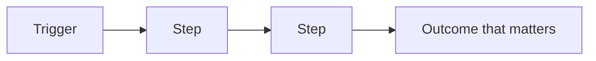
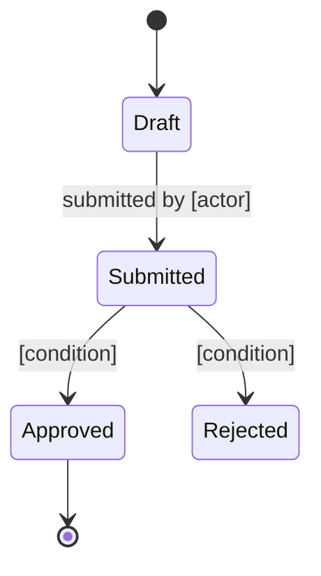

# [Product name] — What this system does

> Reconstructed from the codebase at [commit / date]. This document describes observed behavior only. It does not infer intent or propose corrections.
> Inconsistencies and ambiguities found in the code are recorded as observations with their evidence, not as questions for the reader to resolve.
> **Scope note:** [What was analyzed, what was sampled or excluded, and which facts could not be established from the repository.]

## In one paragraph

[What the product does, for whom, and the problem it removes. Plain language, no technical terms. If someone reads only this paragraph, they should be able to describe the product in a meeting.]

## Who uses it

| Actor | What they do here | What they cannot do |
|---|---|---|
| [Role] | [Their main actions] | [Meaningful restrictions] |

## The main concepts

Explain the four to eight ideas represented in the code. Use the code's observed terminology; if the interface and implementation use different names, record both without deciding which is correct.

### [Concept]

[Definition based on observed behavior. State what happens when one exists, changes, or disappears. Do not state why it exists unless the repository explicitly documents that reason.]

## How the value flows

[Narrate the same flow in two or three sentences: what starts it, what has to be true along the way, what the business gets at the end.]

## Life of a [main entity]

[What each state means for the business, who moves it forward, and which moves are deliberately impossible.]

## The rules of the game

The conditions the system enforces, in business language. Each states what is required and what happens when it is not met.

| Rule | Why it matters | What happens if broken |
|---|---|---|
| [A claim cannot be paid before it is reviewed] | [Prevents paying invalid claims] | [The payment is refused and the claim returns to review] |

## Where the value lives

[The one or two things this system does that are genuinely hard to replace: a calculation, an integration, accumulated data, a manual process it eliminates. Everything else in the product exists to support this.]

## Vocabulary

| Term | Means | Also called |
|---|---|---|
| [Term] | [One-line definition] | [Alias in the interface or in the code] |

> Watch out for: [terms that mean different things to different teams, or the same thing under two names].

## What the code does not establish

Record only missing evidence, such as an external contract, an undocumented rationale, or an actor not represented in the repository. Do not ask the reader to reconcile inconsistencies found in the code; describe those inconsistencies in the relevant section above with their evidence.
