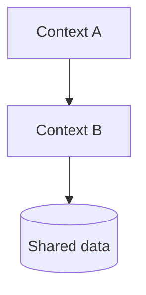
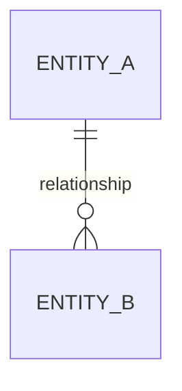
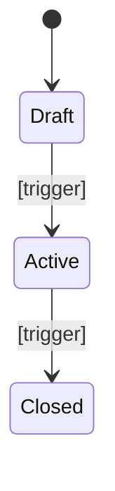

# [Product name] — Technical domain guide

> Reconstructed from the codebase at [commit / date]. This guide describes observed behavior only.
> References point to `path/to/file.ext:line` as of that revision. Do not infer expected behavior or propose corrections. Record inconsistencies, contradictions, and ambiguities as observations with their evidence.

## Orientation

[Two or three sentences: what the system does, what shape it is (single service, monorepo, modular monolith), and where the business logic actually lives versus where it merely passes through.]

*Example:* *Acme Claims is a modular monolith with three deployables (portal, API, worker). The pricing logic lives entirely in `src/pricing/`; the rest is request routing, persistence, and presentation. Anything you change in `src/pricing/` needs a corresponding update to the per-insurer golden fixtures under `tests/fixtures/insurers/`.*

**Discovery boundary:** [Contexts and deployables analyzed.] **Sampled or excluded:** [Areas intentionally not read and why.] **Confidence limits:** [Missing tools, unavailable contracts, conflicting evidence, or recommended next context.]

## Three things that would surprise a newcomer

[Three observed findings — drawn from the code, not inferred — that contradict what a reasonable reader would assume before opening the code. Each states what is surprising, why it is surprising, and the evidence. Hard cap at three; longer lists become decoration. Same findings appear in `BUSINESS_OVERVIEW.md § Three things that would surprise a newcomer` in business language.]

*Example:*
1. *The "Paid" transition is guarded twice with different rules.* *`src/claims/service.py:142` allows `Submitted → Rejected`; `migrations/0042.sql:18` does not. Either side can be patched without the other noticing.* — `src/claims/service.py:142`, `migrations/0042.sql:18`
2. *Pricing logic is duplicated in two places that diverge on rounding.* *`src/pricing/engine.py` uses banker's rounding; `src/payments/calculator.py` rounds half-up. There is no shared helper.* — `src/pricing/engine.py:201`, `src/payments/calculator.py:88`
3. *The legacy `legacy_submit()` function is referenced by nothing but still imported.* *Imports come from a script that was removed in commit `a1b2c3d`. The function is dead but the import chain keeps the module alive.* — `src/claims/actions.py:204`, `git log --follow src/claims/actions.py`

## Read these first

**Read these first:** `path/a.ext`, `path/b.ext`, `path/c.ext` — the three files that explain the most about the domain.

**Start here for the actual task** — action entries that point a contributor at the right place for what they came to do, not what they came to learn:

- *Fixing a bug in `<area>`:* start at `<path:line>`; tests in `<path>`; owner `<team or person>`. Do not change `<path:line>` without reading `<policy path>` (rule R-NNN).
- *Deploying:* `<command>`; production requires `<team>` approval; recent incident evidence at `<path:line>`.
- *On-call:* logs at `<location>`; runbook at `<path>`; page `<team>` for SEV-1.
- *Onboarding for the long haul:* read Orientation, then Domain map, then the Invariants section for the module you will own.

*Example:*

- *Fixing a pricing bug:* `src/pricing/rounding.py:14`; tests in `tests/pricing/golden/`; owner `@pricing-team`. Do not change the rounding policy without `docs/policies/rounding.md` (rule R-007).
- *Deploying:* `bin/deploy.sh --env=staging`; production requires `@ops` approval. The last deploy failure was caused by missing permissions on `s3://acme-fee-schedules/` — `terraform/main.tf:88`.
- *On-call:* Datadog dashboard `acme-claims-prod`; runbook `docs/runbooks/`. SEV-1: page `@claims-oncall`; infrastructure: `@platform-oncall`.

## Domain map

| Bounded context / module | Path | Owns | Depends on |
|---|---|---|---|
| [Name] | `src/...` | [Concepts it is authoritative for] | [Other contexts] |

*Example:*
| *Pricing* | *`src/pricing/`* | *Fee schedules, rounding, currency conversion* | *Insurer registry (read-only)* |
| *Claims lifecycle* | *`src/claims/`* | *Status transitions, reviewer assignment, deadlines* | *Pricing (read-only), Audit (writes)* |

[Where the boundaries are clean and where they leak. Describe leaks as observed relationships or conflicting behavior, with evidence; do not infer which boundary is correct.]

## Model

| Entity | Defined at | Identity | Notes |
|---|---|---|---|
| [Name] | `path:line` | [Natural or surrogate key] | [Aggregate root, value object, lifecycle owner] |

*Example:*
| *Claim* | *`src/claims/models.py:21`* | *Surrogate (`claim_id`); natural key is `(hospital_id, insurer_ref)`* | *Aggregate root; owns its Review and Payment rows.* |
| *Reviewer* | *`src/accounts/models.py:55`* | *Surrogate (`user_id`)* | *Not an aggregate root; assigned to Claims via a join table.* |

## Lifecycles

| Transition | Enforced at | Guard | On violation |
|---|---|---|---|
| Draft → Active | `path:line` | [Condition] | [Error raised / behaviour] |

*Example:*
| *Submitted → In Review* | *`src/claims/service.py:142`* | *`reviewer_id is not None`* | *Raises `NoReviewerAssigned`; the API returns 409.* |
| *In Review → Paid* | *`src/claims/service.py:198`, `migrations/0042.sql:18`* | *Both the service-level guard and the DB CHECK* | *Service raises `PaymentBeforeReview` (422); DB rejects the UPDATE if the guard is bypassed.* |

Transitions that are deliberately absent: [list them — knowing what is impossible is as useful as knowing what is possible].

## Invariants and business rules

Grouped by concept. Each rule states what it enforces, where it is enforced, and what happens when it is violated. Note where the same rule is enforced in more than one layer, and where it is enforced in none.

### [Concept]

| Rule | Evidence | Confidence | Failure mode | Rationale |
|---|---|---|---|---|
| [What must hold] | `path:line` | [high / medium / low] | [Exception, HTTP status, silent fallback] | [Documented rationale / not stated in repository] |

*Confidence —* *high:* enforced by typed error + DB constraint + a test covering the violation. *medium:* enforced at one layer only (e.g., only at the API or only at the DB). *low:* observed convention in one place, no test, no second enforcement layer. Surface `low` rules explicitly so reviewers do not over-trust them.

*Example:*
| *A claim cannot move to Paid without a reviewer_id* | *`src/claims/service.py:198`, `migrations/0042.sql:18`* | *high* | *Service raises `PaymentBeforeReview`; DB CHECK rejects the row UPDATE.* | *Stated in `docs/policies/audit.md:4`.* |
| *A reviewer cannot approve claims from their own hospital* | *`src/accounts/policy.py:71`* | *medium* | *API returns 403; nothing in the DB layer re-checks this.* | *Not stated in the repository; inferred from the insurer contract in `docs/contracts/insurer-acme.md`.* |

## Policies, constants and calculations

| What | Value | Location | Configurable |
|---|---|---|---|
| [Threshold, rate, window] | [Value] | `path:line` | [Yes / hardcoded] |

[Calculation logic worth understanding before touching it: rounding, precision, ordering of operations, currency handling. Describe what is implemented, including divergent implementations, without selecting an intended one.]

## Permissions and visibility

| Actor | Can | Enforced at |
|---|---|---|
| [Role] | [Operations] | `path:line` |

[Tenant or organization scoping: how it is applied, and where it could be forgotten.]

## Time-driven behaviour

| Job / trigger | Schedule | Business effect | Location |
|---|---|---|---|
| [Name] | [Cron or event] | [What changes in the business] | `path:line` |

## External contracts

| System | Direction | Purpose | Adapter |
|---|---|---|---|
| [Name] | inbound / outbound | [Business role] | `path:line` |

[What breaks in business terms when each one is unavailable.]

## Where the value lives, technically

[The modules that carry the differentiating logic, and why. This is where reviews should be strictest and test coverage highest.]

## Risks and observations

Things a newcomer should know before their first change. Facts and their direct consequences, not opinions about style or guesses about intended behavior. Tag each observation with a severity so readers can triage: *BLOCKER* (rule enforced in two layers that can diverge — fix before changing either side), *RISK* (hardcoded threshold, magic number, business logic in a migration — review carefully), *SMELL* (dead branch, naming confusion, observation without immediate action).

- **BLOCKER — [Observation]** — `path:line`. [Why it is a blocker: rule enforced in two layers that can diverge, etc.]
- **RISK — [Observation]** — `path:line`. [Why it is a risk: hardcoded threshold, unbounded query, business logic in a migration, etc.]
- **SMELL — [Observation]** — `path:line`. [Why it is a smell: dead branch, naming confusion, etc.]

*Example:*

- **BLOCKER — Claim status transitions are guarded in two places** — `src/claims/service.py:142` and `migrations/0042.sql:18`. The Python guard allows `Submitted → Rejected`; the DB constraint does not. Either side can be patched without the other noticing.
- **RISK — Insurer fee schedules are committed as JSON in the repo** — `config/fees/insurer-acme.json:1`. A change requires a full deploy; there is no admin UI or feature flag. Hot-fixing a pricing bug takes a release cycle.
- **SMELL — `legacy_submit()` in `src/claims/actions.py:204` is unreachable** — no caller exists in the current codebase. Either dead code or referenced from a script that was removed.

### Terminology traps

Naming mismatches between the code and the business. Each row names the trap, the two meanings, and where it shows up. List only traps that have caused or could cause a wrong business decision — not minor synonyms. Cross-reference `BUSINESS_OVERVIEW.md § Terminology traps` for the same entries in business language.

| Code / UI term | Business meaning | Why it confuses | Defined at |
|---|---|---|---|
| [Term as it appears] | [What the business actually means] | [The wrong assumption] | `path:line` |

*Example:*
| *`submit_claim()`* | *Send to internal review* | *The function name suggests sending to the insurer; it only enqueues for Acme's internal review. See also BUSINESS_OVERVIEW.md § Terminology traps.* | `src/claims/actions.py:88` |

## Glossary (code ↔ business)

| Code term | Business term | Defined at | Note |
|---|---|---|---|
| `[Identifier]` | [Business word] | `path:line` | [Synonym, homonym, or legacy naming] |

*Example:*
| *`ClaimStatus.PAID`* | *Paid* | *`src/claims/enums.py:7`* | *Same status name as the legacy Perl codebase, kept for audit-log continuity.* |
| *`payout_amount_cents`* | *Net payout* | *`src/payments/models.py:33`* | *Field stored in cents; UI shows dollars. Watch for off-by-100 bugs when reading the value back.* |

## Related contexts

When the domain spans several bounded contexts, a per-context file is generated for each in `domains/`. This guide lists every one, and every per-context file's "Related contexts" links back here. Update both directions: omitting the link breaks navigation for the reader.

| Context | File | Relationship |
|---|---|---|
| [Name] | [`domains/<other>.md`](domains/<other>.md) | [Reads from / writes to / triggered by / …] |
| Business overview | [`BUSINESS_OVERVIEW.md`](BUSINESS_OVERVIEW.md) | Per-context files cross-link here for product-wide rules and the "Three things that would surprise a newcomer". |

If the product has only one context, replace this section with: *"This product is a single bounded context; no per-context files are produced."*

## Information absent from the repository

List only facts that cannot be established from the repository, such as invisible external contracts or undocumented rationale. Do not ask a human to resolve an observed inconsistency; record the competing behaviors in the relevant sections above.

1. **[Missing fact]** — [Evidence showing that the repository does not establish it: `path:line`.]

*Example:*
1. *Who negotiates the per-insurer fee schedule — product or finance? The code reads schedules from `config/fees/` but nothing in the repository identifies the owner or the cadence.*
2. *What is the contractual SLA with each insurer after the 48h internal review window expires? The code escalates to a human but does not record what the insurer is then obligated to do.*
